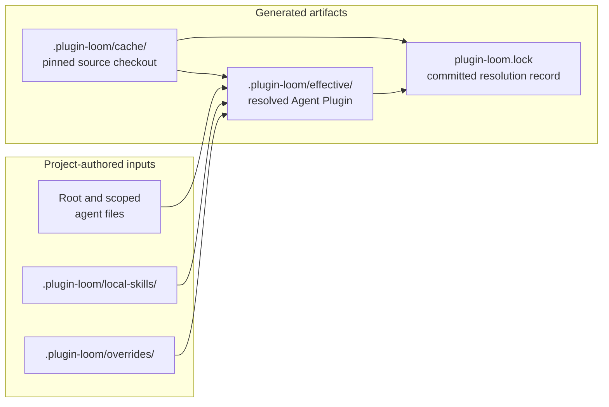

# plugin-loom

An Agent Plugins client with a skills.sh-style path for external skill installs, version-controlled local overrides, and control over skill-context bloat.

You add the shared plugins your team trusts, enable broad guidance at the repository root, and enable specialized guidance only beside the relevant domain. Plugin Loom pins the exact source commits, shows what is active, and generates one local Agent Plugin package for your client to load.

See the [concepts and workflow](docs/concepts-and-workflow.md) for a guided setup, including root and domain catalog activation.

## What it feels like to use

Most of the time, the workflow is small:

```bash
# After changing sources, catalogs, or local overrides.
plugin-loom sync

# Before relying on the generated guidance or committing a configuration change.
plugin-loom check

# When you want to see which skills apply in your current area of work.
plugin-loom list --effective
```

If you move into a specialized part of a repository, such as `services/fhir`, Plugin Loom reads that directory's `AGENTS.md` as well as the configured root agent file. You receive the root guidance plus the FHIR-specific catalogs, rather than every possible skill in every session.

When your project needs one additional guardrail, extend or patch the shared skill in `.plugin-loom/overrides/`. Your change stays version-controlled and survives resyncing; the original plugin source remains unchanged.

## How it works

It uses the [Agent Plugins v1](https://agent-plugins.org/specification) portable boundary without redefining it:

```text
shared-plugin/
├── plugin.json
└── skills/
    └── deploy/
        └── SKILL.md
```

`plugin.json` and `skills/*/SKILL.md` remain portable. Source pinning, catalog activation, and project overlays are resolver policy, not additions to the portable manifest.



Project inputs are authored; the cache, effective plugin, and lock are generated. The lock is generated but committed, so the exact resolution is reviewable and reproducible.

## Project layout

```text
project/
├── AGENTS.md                       # default root agent file; enables the ADLC catalog
├── plugin-loom.yaml               # committed source, selection, and override policy
├── plugin-loom.lock               # committed exact Git commits and effective inventory
└── .plugin-loom/
    ├── local-skills/                # committed project-owned skills
    ├── overrides/                   # committed extends, patches, and replacements
    ├── cache/                       # ignored Git checkouts
    └── effective/                   # ignored generated Agent Plugin package
        ├── plugin.json
        └── skills/
```

Never edit `.plugin-loom/cache/` or `.plugin-loom/effective/` directly.

## Install

```bash
pipx install plugin-loom
```

For development from a clone:

```bash
python -m pip install -e .
```

## Configure a project

Create `plugin-loom.yaml`:

```yaml
version: 1
sources:
  - id: reason-health
    repo: https://github.com/example/reason-health-plugins.git
    ref: v1.8.0
    # Source-level skills enabled for this source in every scope.
    core:
      - git-workflow
    # Named groups activated from root or scoped agent files.
    catalogs:
      adlc:
        - planning
        - implementation
        - code-review
      release-process:
        - deploy
        - incident-response
      qa:
        - testing
        - test-automation
      frontend-design:
        - frontend-design
        - accessibility

# The root catalog file; defaults to AGENTS.md when omitted.
rootAgentFile: AGENTS.md

# Explicitly selected skills are always available.
core:
  - reason-health/code-review

overrides:
  reason-health/code-review:
    mode: extend
    path: .plugin-loom/overrides/code-review
```

Enable the ADLC workflow catalog at the root. `--when` is required and records the inclusion context beside the catalog in the configured root agent file; the command then syncs by default:

```bash
plugin-loom enable reason-health/adlc \
  --when "Any task that plans, implements, reviews, or ships software changes."
```

For domain-specific guidance, target the directory it governs. These commands write scoped `AGENTS.md` files and sync each scope:

```bash
plugin-loom enable reason-health/release-process \
  --path ops/release \
  --when "Preparing, approving, or executing a release."
plugin-loom enable reason-health/qa \
  --path tests \
  --when "Writing, running, or investigating automated tests."
plugin-loom enable reason-health/frontend-design \
  --path apps/web \
  --when "Changing user-facing flows, components, or visual design."
```

The resolver reads the configured root file and applicable scoped `AGENTS.md` files from the project root to the working directory.

## Shared plugin catalogs

Each source's `core` and `catalogs` live in the corresponding `sources` entry in `plugin-loom.yaml`, alongside the pinned repository and ref. This is resolver policy rather than part of the source plugin manifest.

Every named skill must be present in the pinned source plugin's immediate `skills/<skill>/SKILL.md` directory. The source itself remains a portable Agent Plugin, so any compatible client can discover its `plugin.json` and skills without Plugin Loom configuration.

## Local skills and overrides

Project-owned standalone skills live in `.plugin-loom/local-skills/<skill>/SKILL.md`.

Shared skills may be customized only through an explicit `overrides` declaration:

| Mode | Path shape | Behavior |
|---|---|---|
| `extend` | directory containing `SKILL.md` | Appends project instructions under `## Project overlay`; extra files are added to the generated skill. |
| `patch` | unified diff file | Applies the diff against the pinned source skill; sync fails if it no longer applies. |
| `replace` | directory containing `SKILL.md` | Replaces the shared skill completely; a `reason` is required. |

An unintentional duplicate effective skill name is an error. This prevents one source or local skill from silently shadowing another.

## Commands

```bash
# Resolve refs, validate plugins, apply local overlays, and write the effective package.
plugin-loom sync

# Validate without writing generated output.
plugin-loom check

# Inspect the source, commit, and override mode for each resolved skill.
plugin-loom list --effective

# Compare the current generated package with a newly resolved package.
plugin-loom diff --effective

# Change one source ref and refresh the lock file and generated package.
plugin-loom update reason-health --to v1.9.0

# Enable a validated catalog and record when agents should include it.
plugin-loom enable reason-health/adlc --when "Any software delivery task."
plugin-loom enable reason-health/qa --path tests --when "Writing or investigating automated tests."
```

`sync` writes the exact source commits and every generated-file hash to `plugin-loom.lock`. Commit that lock file along with `plugin-loom.yaml`, local skills, overrides, the configured root agent file, and applicable scoped `AGENTS.md` files.

## Standards boundary

Agent Plugins v1 currently standardizes a root `plugin.json`, skills in `skills/`, and optional `mcp.json`; it does not standardize dependency manifests, Git update policy, catalogs, or overlays. `plugin-loom` deliberately keeps those concerns in its own `plugin-loom.yaml` and generated package, so a shared source remains usable by any compatible Agent Plugins client.

This project is not affiliated with the Agent Plugins specification or its maintainers.

## Learn the workflow

Read [Concepts and workflow](docs/concepts-and-workflow.md) for a walkthrough of source plugins, root and domain-specific catalogs, installation, and local overrides. See the [external plugin installation design](docs/external-plugin-installation-design.md) for the proposed `skills.sh`-style add flow.

Sponsored by [Vermonster](https://vermonster.com).
